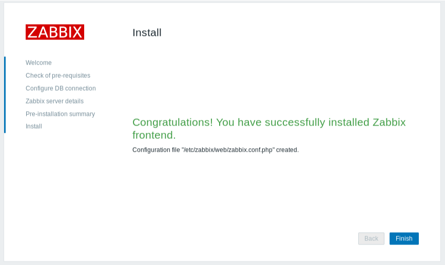

## 实验环境

CPU 4 vcpu 内存2G  硬盘20G 

vmware workstation 14 pro 

系统版本 

 CentOS Linux release 7.8.2003 (Core) CentOS 7 x64

内核版本 

Linux localhost.localdomain 3.10.0-1127.el7.x86_64 #1 SMP Tue Mar 31 23:36:51 UTC 2020 x86_64 x86_64 x86_64 GNU/Linux


## 网络设置

vmware 桥接模式

静态ip 192.168.0.201 

网关&dns 192.168.0.1

网卡 eth0  

hostname zabbix_server

selinux&firewalld disabled

zabbix_server hosts:

192.168.0.201 zabbix_server zabbix_server.igmao.com

192.168.0.202 mysql_master mysql_master.igmao.com

192.168.0.203 mysql_master mysql_slave.igmao.com

详细环境配置参考: 

<http://k8s.unixhot.com/example-manual.html>


## 依赖软件安装

### 一: nginx-1.18.0

nginx: 源码包官网 https://nginx.org/en/download.html

nginx安装教程: <https://blog.csdn.net/qq_37345604/article/details/90034424>

源码包编译安装后，nginx主程序和conf配置文件都在：

/usr/local/nginx/sbin

/usr/local/nginx/conf

默认网站目录在

 /usr/local/nginx/html

最好给nginx程序目录截图解释说明


nginx快速控制命令：

cd /usr/local/nginx/sbin

启动nginx： ./nginx

停止nginx： ./nginx -s stop

查看nginx进程状态： ps -ef | grep nginx


### 二: php  7.2

安装及常用命令教程 http://www.itcast.cn/news/20191212/14404384089.shtml 

php安装成功测试：https://blog.csdn.net/dangerous_fire/article/details/9122869 

php-fpm快速控制命令

设置开机自启  sudo systemctl enable php72-php-fpm.service

开启服务 sudo systemctl start php72-php-fpm.service 

停止服务  sudo systemctl stop php72-php-fpm.service 

查看状态  sudo systemctl status php72-php-fpm.service

​	

nginx调用php-fpm设置（nginx有默认的fastcgi.params配置，如何默认的不行的话，就要在nginx.conf文件中修改或在fastcgi.params文件中修改）：https://www.cnblogs.com/xjh713/p/5850934.html

修改fastcgi.params配置文件 :  <https://blog.csdn.net/feiniao8651/article/details/52768911>


ps：

一: 打开php动态页面一片空白的原因分析：

1，fastcgi配置错误，导致php-fpm解析了不到页面文件。

2，页面文件所在目录的权限问题。

3，php页面文件里面代码有问题。

二: 怎么查看php的配置文件 php.ini

访问phpinfo.php文件里面有。不同的版本不同的系统不同的安装方式会导致配置文件的路径都不一样。

当前环境的配置文件的路径是： /etc/opt/remi/php72/php.ini 

三: 关于nginx/apache/php等用户的安全性问题：（值得研究，和系统加固有关）

https://www.cnblogs.com/hanyouchun/p/5159889.html


### 三: mysql 8.0.18

192.168.0.106:3306 

用户root 密码keke


## zabbix部署

​	官方安装教程：https://www.zabbix.com/download?zabbix=4.4&os_distribution=centos&os_version=7&db=mysql&ws=nginx 

​	1,安装zabbix

​	//下载包

```shell
rpm -Uvh https://repo.zabbix.com/zabbix/4.4/rhel/7/x86_64/zabbix-release-4.4-1.el7.noarch.rpm
yum clean all
```

​	//安装server端和agent端	

```shell
yum install zabbix-server-mysql zabbix-agent
```

​	2,安装 server 的 web 前端服务

​	//安装epel 扩展源

```shell
yum install epel-release
```

​	//安装 zabbix web 前端程序(mysql 用户端 和 配置nginx)

```shell
yum install zabbix-web-mysql zabbix-nginx-conf
```

​	3,初始化 zabbix 库

​	//在mysql主机192.168.0.106 操作：

```shell
mysql -uroot -p
```

​	//创建zabbix库

```shell
mysql> create database zabbix character set utf8 collate utf8_bin;
```

​	//新建用户zabbix，密码也是zabbix，%表示该用户可在任何主机上登陆，

```shell
mysql> create user ‘zabbix’@‘%’ identified by 'zabbix';
```

​	//zabbix库的所有权限开放给zabbix用户

```shell
mysql> grant all privileges on zabbix.* to ’zabbix‘@‘%’;
mysql> quit;	
```

​	在zabbix_server主机192.168.0.201操作：

​	//初始化zabbix库,-u和-p是帐号密码，再后面接的数据库名。

```shell
zcat /usr/share/doc/zabbix-server-mysql*/create.sql.gz | mysql -h 192.168.0.106 -P 3306 -uzabbix -pzabbix zabbix
```

​	ps: systemctl控制源码包安装的程序

​	控制nginx：

​	<https://blog.csdn.net/qq_21437451/article/details/82530057>

​	nginx会报错“/var/run/nginx.pid" no such file or directory的解决：

​	到nginx.conf 文件中设置

```shell
pid	/var/run/nginx.pid
```

​	

​	4, zabbix web前端配置

​	zabbix web目录 ：	

```shell
/usr/share/zabbix 
```

​	zabbix web配置文件目录：

```shell
cd /etc/zabbix/web
```

​	拷贝zabbix web前端程序目录到 nginx的网页根目录中：

```shell
cp -R /usr/share/zabbix /usr/local/nginx/html
```

​	

​	6, 开启zabbix服务端和客户端。

​	zabbix进入前端搭建界面。
nginx端口设置为44669
localhost:44669/zabbix
http://mrkeorg.123nat.com:44669/zabbix


安装完成：



​	php bcmath fail解决：

```shell
yum install *bcmath* --skip-broken
```

​	php.ini中添加： 

```shell
extension=bcmath.so
```

​	ldap warning解决：

```shell
yum install *ldap* --skip-broken
```

​	php.ini中添加： 

```shell
extension=ldap.so
```

ps：

1，安装时连接mysql前，要注意关闭selinux，否则zabbix前端程序无法链接数据库。

2，zabbix前端配置文件：

```shell
/etc/zabbix/web/zabbix.conf.php
```

3，zabbix前端默认登陆密码

​	 Admin  zabbix
4，zabbix_server log路径：

```
find / -name zabbix_server.log 
/var/log/zabbix/zabbix_server.log
```

5，如果数据库不在本地主机，需要去zabbix_server.conf 配置数据库的ip，库名，用户名密码。
  （这个方式不使用zabbix_server的mysql.sock）

```
//案例使用的数据库主机IP地址
DBHost = 192.168.0.106 
```


## zabbix使用教程10则：


[http://www.zsythink.net/archives/category/%e8%bf%90%e7%bb%b4%e7%9b%b8%e5%85%b3/zabbix/](http://www.zsythink.net/archives/category/%E8%BF%90%E7%BB%B4%E7%9B%B8%E5%85%B3/zabbix/) 

zabbix 分布式监控

https://www.cnblogs.com/zhangweiyi/p/10534408.html 

